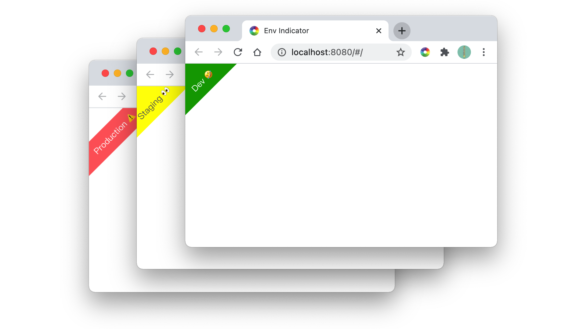

# Env Indicator Browser Extension

Add an indicator to differentiate QA environments from production. In addition, you can create your own indicator rules

[](https://travis-ci.com/gaoliang/env-indicator)
[](https://chrome.google.com/webstore/detail/env-indicator/kgdbcpllbbnimjgoiomfdebldcofmlbl)
[](https://chrome.google.com/webstore/detail/env-indicator/kgdbcpllbbnimjgoiomfdebldcofmlbl)
### Screenshots



## Dev

### Install the dependencies
```bash
yarn
```

### Start the app in development mode (hot-code reloading, error reporting, etc.)
```bash
quasar dev
```

### Lint the files
```bash
yarn run lint
```

### Build the app for production
```bash
quasar build
```

### Customize the configuration
See [Configuring quasar.conf.js](https://quasar.dev/quasar-cli/quasar-conf-js).
